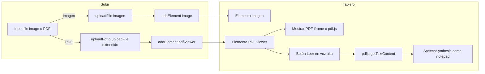

# Plan: Botón Subir con PDF, visor en tablero y lectura en voz alta

## Estado actual

- **Botón Subir** (icono carpeta): en [tools-sidebar.tsx](src/components/canvas/tools-sidebar.tsx) y [mobile-menu.tsx](src/components/canvas/mobile-menu.tsx) llama `onUploadImage`.
- **handleUploadImage** en [BoardPageClient.tsx](src/app/board/[boardId]/BoardPageClient.tsx) (líneas 624-651): input `accept="image/*"`, usa [upload-helper.ts](src/lib/upload-helper.ts) y luego `addElement('image', ...)`.
- **[upload-helper.ts](src/lib/upload-helper.ts)**: `uploadFile()` solo permite tipos de imagen (`allowedTypes`: jpeg, png, gif, webp, svg); rechaza PDF y otros tipos.
- **No existe** ningún elemento tipo visor PDF ni flujo de subida de PDF en el proyecto.
- **Lectura en voz alta en notepad**: [notepad-element.tsx](src/components/canvas/elements/notepad-element.tsx) — `handleReadAloud` (líneas 981-1027), `getReadableText` (extrae texto de HTML de páginas), `SpeechSynthesisUtterance`, [speech-voice.ts](src/lib/speech-voice.ts) `getDefaultSpeechVoice()`, botón con iconos Volume2 / Pause / Square (líneas 1163-1176).

## Enfoque propuesto

1. Permitir en el botón Subir elegir **imagen o PDF** (un input con `accept="image/*,.pdf"` o un pequeño menú "Subir imagen" / "Subir PDF").
2. **Subir PDF**: ampliar (o complementar) el helper de subida para aceptar `application/pdf`, subir a Storage en una ruta tipo `users/{userId}/pdfs/` y devolver la URL.
3. **Elemento en el tablero**: nuevo tipo `pdf-viewer` que reciba la URL del PDF, lo muestre (iframe o visor con pdf.js) y tenga un botón **"Leer en voz alta"** como el del notepad.
4. **Lectura en voz alta del PDF**: extraer texto del PDF en el cliente (necesaria una librería, p. ej. **pdfjs-dist**) y usar la misma lógica que el notepad: `SpeechSynthesisUtterance`, `getDefaultSpeechVoice()`, controles Play/Pause/Stop.

## Tareas de implementación

### 1. Soporte de subida de PDF

- **Archivo**: [src/lib/upload-helper.ts](src/lib/upload-helper.ts)
- Añadir en `uploadFile` (o crear `uploadPdf`) aceptación de `application/pdf`:
  - Validar `file.type === 'application/pdf'`.
  - Límite de tamaño razonable (p. ej. 20–50 MB).
  - No comprimir; subir el archivo tal cual a una ruta como `users/{userId}/pdfs/{timestamp}_{id}.pdf`.
  - Devolver la misma estructura `UploadResponse` con la URL del PDF.
- Mantener el comportamiento actual para imágenes sin cambios.

### 2. Flujo del botón Subir en la app

- **Archivos**: [BoardPageClient.tsx](src/app/board/[boardId]/BoardPageClient.tsx), y si se usa en móvil, [mobile-board-client.tsx](src/components/canvas/mobile/mobile-board-client.tsx).
- Opción A (recomendada): un solo input con `accept="image/*,.pdf"`. En el `onchange`:
  - Si `file.type.startsWith('image/')`: flujo actual (`uploadFile` + `addElement('image', ...)`).
  - Si `file.type === 'application/pdf'`: llamar a la nueva subida de PDF y `addElement('pdf-viewer', { content: { url: result.url, fileName: file.name } })`.
- Opción B: convertir "Subir" en dropdown "Subir imagen" / "Subir PDF", cada uno con su input y su `accept`.
- Añadir un handler tipo `handleUploadPdf` (o integrarlo en `handleUploadImage` renombrado a "handleUploadFile") que cree el input, acepte PDF y llame a `addElement('pdf-viewer', ...)`.

### 3. Tipo y contenido del elemento PDF en el canvas

- **Archivo**: [src/lib/types.ts](src/lib/types.ts)
- Añadir a `ElementType` el valor `'pdf-viewer'`.
- Definir una interfaz para el contenido, por ejemplo:
  - `PdfViewerContent`: `{ url: string; fileName?: string }` (y opcionalmente `extractedText?: string` si se cachea el texto para lectura en voz alta).

### 4. Componente del visor PDF en el tablero

- **Nuevo archivo**: `src/components/canvas/elements/pdf-viewer-element.tsx`
- Registrar el tipo en [transformable-element.tsx](src/components/canvas/transformable-element.tsx) y, si aplica, en [canvas.tsx](src/components/canvas/canvas.tsx) (mapeo tipo → componente).
- El componente debe:
  - Recibir `content.url` (y opcionalmente `fileName`) y mostrarlo:
    - **Opción simple**: `<iframe src={url} title="PDF" />` para solo visualizar (sin extracción de texto en cliente).
    - **Opción con lectura en voz alta**: usar **pdfjs-dist** para renderizar páginas y/o extraer texto (ver punto 5).
  - Incluir un **botón "Leer en voz alta"** (mismo patrón que notepad: icono Volume2, y al leer Pause/Square), que dispare la lectura del texto extraído del PDF.
  - Diseño tipo "carta" en el canvas (arrastrable, redimensionable) similar a imagen/notepad: header con título (p. ej. nombre del archivo), área del visor, barra con botón de lectura en voz alta.
  - Reutilizar [speech-voice.ts](src/lib/speech-voice.ts) `getDefaultSpeechVoice()` y la lógica de notepad para `SpeechSynthesisUtterance` (idioma, velocidad, etc.).

### 5. Extracción de texto del PDF y lectura en voz alta

- **Librería**: no hay hoy ninguna para PDF en el proyecto. Añadir **pdfjs-dist** (Mozilla PDF.js) para:
  - Cargar el documento desde `content.url`.
  - Recorrer páginas y usar `getTextContent()` (y unir el texto) para pasarlo a la síntesis de voz.
- En `pdf-viewer-element.tsx`:
  - Al hacer clic en "Leer en voz alta", cargar el PDF con pdfjs (worker si es necesario), extraer texto de todas las páginas (o de la página actual, según diseño), y llamar a `window.speechSynthesis` con el mismo patrón que notepad (cancelar anterior, reanudar/pausar si ya está leyendo).
  - Opcional: cachear el texto extraído en estado o en `content.extractedText` para no re-extraer en cada clic.
- Reutilizar la misma UX que notepad: un solo botón que alterna Play/Pause y, si se desea, botón Stop (Square) cuando `isReading === true`.

### 6. Menús y herramientas

- Si se elige **Opción B** (dropdown Subir imagen / Subir PDF): actualizar [tools-sidebar.tsx](src/components/canvas/tools-sidebar.tsx) y [mobile-menu.tsx](src/components/canvas/mobile-menu.tsx) para que el botón "Subir" abra un menú con las dos opciones en lugar de un solo click a imagen.
- Si se elige **Opción A**: no hace falta cambiar la UI del botón; solo la lógica en `BoardPageClient` (y móvil) para distinguir imagen vs PDF en el `onchange` del input.

## Resumen de archivos a tocar o crear

| Acción | Archivo |
|--------|---------|
| Modificar | [src/lib/upload-helper.ts](src/lib/upload-helper.ts) — aceptar PDF y subir a Storage |
| Modificar | [src/app/board/[boardId]/BoardPageClient.tsx](src/app/board/[boardId]/BoardPageClient.tsx) — input imagen+PDF y/o handler PDF, addElement('pdf-viewer') |
| Modificar | [src/components/canvas/mobile/mobile-board-client.tsx](src/components/canvas/mobile/mobile-board-client.tsx) — mismo flujo si el botón Subir existe en móvil |
| Modificar | [src/lib/types.ts](src/lib/types.ts) — ElementType 'pdf-viewer', PdfViewerContent |
| Crear | [src/components/canvas/elements/pdf-viewer-element.tsx](src/components/canvas/elements/pdf-viewer-element.tsx) — visor + botón leer en voz alta |
| Modificar | [src/components/canvas/transformable-element.tsx](src/components/canvas/transformable-element.tsx) — registrar tipo 'pdf-viewer' |
| Añadir dependencia | package.json — `pdfjs-dist` (versión compatible con Next/React y worker en cliente) |

## Notas

- **CORS**: Si el PDF se sirve desde otro dominio (p. ej. Firebase Storage), asegurar que la URL sea accesible desde el cliente para iframe y para pdfjs (configuración CORS en Storage si hace falta).
- **Worker de pdfjs**: En Next, el worker de pdfjs-dist suele configurarse para ejecutarse en el cliente (dynamic import o copy del worker al public); conviene seguir la guía oficial de pdfjs-dist para React/Next.
- **Voz**: Reutilizar exactamente el mismo patrón que notepad (getDefaultSpeechVoice, idioma es-ES, botón Volume2/Pause/Square) para mantener consistencia con "el mismo botón notepad".
